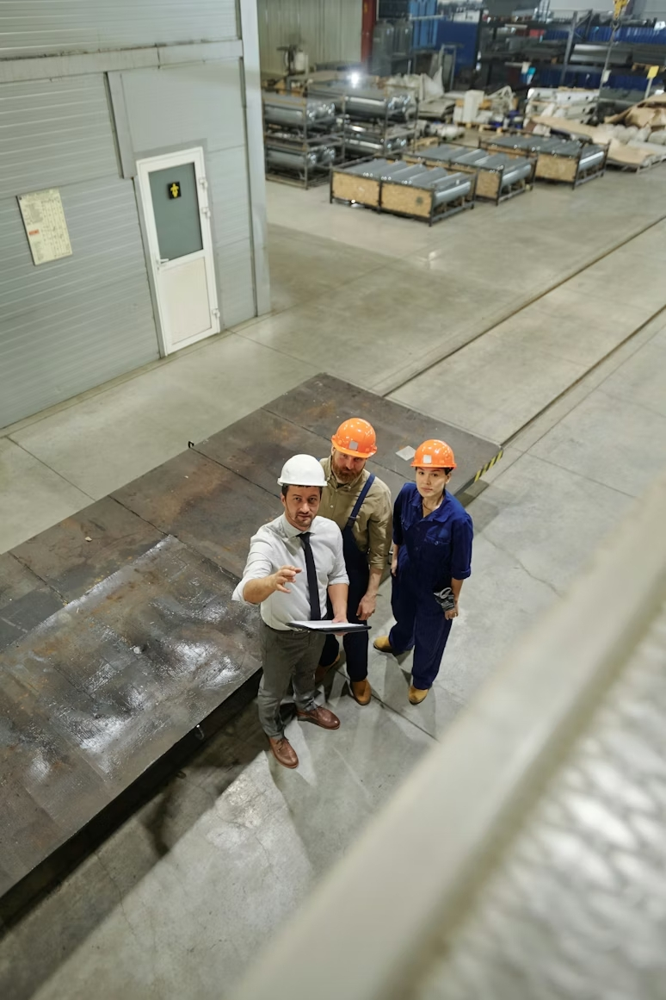

# 🛡️ VisionShield AI

> **Privacy-preserving visual protection system** — portfolio demo inspired by multi-stage chaos-based image encryption research.



---

## Overview

VisionShield AI reinterprets an academic hyperchaos image encryption paper as a product-oriented privacy system.  
Instead of a static academic reproduction it ships as a fully interactive Streamlit app with three tabs:

| Tab | What it shows |
|---|---|
| **Demo** | Side-by-side view of original → processed → protected → restored image |
| **Analysis** | RGB histograms + entropy / SSIM / PSNR metrics comparing input and output |
| **Explanation** | Clickable pipeline nodes, paper reference, use-case framing |

---

## Pipeline

```
Input image
    │
    ▼
Preprocessing  ──  optional edge overlay (Canny), resize to max dimension
    │
    ▼
Stage 1 · Seeded diffusion     (6D hyperchaotic XOR noise, seed-derived)
    │
    ▼
Stage 2 · Structural permutation  (8D — deterministic spatial roll)
    │
    ▼
Stage 3 · Nonlinear substitution  (9D — dynamic S-box factor + bias)
    │
    ▼
Protected output  ──  full frame  OR  selective region (encrypt / blur)
```

Full encryption applies all three stages to every pixel.  
Selective protection detects sensitive regions via OpenCV and applies only to those areas.

---

## Features

- **Full encryption** — 3-stage chaos pipeline over the entire frame  
- **Selective protection** — ROI detection + either chaos-based XOR or Gaussian blur  
- **Master seed** — all pseudo-random sequences derived from a single user-supplied string  
- **Edge overlay** — Canny-blended preprocessing view for structural inspection  
- **Analysis tab** — per-channel RGB histograms, SSIM, PSNR, entropy delta  
- **Clickable pipeline nodes** — `st.pills`-based interactive flow diagram  
- **Sidebar tooltips** — every control has a `help=` explanation grounded in the paper  

---

## Tech stack

| Layer | Library |
|---|---|
| UI / app server | Streamlit 1.55 |
| Image processing | OpenCV, Pillow |
| Numerical ops | NumPy |
| Visualisation | Matplotlib |
| Data | Pandas |

Python 3.10 +

---

## Quickstart

```bash
# 1 — clone and enter the project
git clone <repo-url>
cd VisionShieldAI

# 2 — create a virtual environment
python -m venv .venv
.venv\Scripts\activate          # Windows
# source .venv/bin/activate     # macOS / Linux

# 3 — install dependencies
pip install -r requirements.txt

# 4 — run
streamlit run app.py
```

The app opens at `http://localhost:8501`.  
Use the sidebar to switch protection mode, adjust the seed, upload your own image, or toggle options.

---

## Project structure

```
VisionShieldAI/
├── app.py                  # Entry point — page config, tabs, sidebar wiring
├── requirements.txt
├── test_imgs/
│   └── caras_drone.jpg     # Built-in demo image (drone scene, sensitive faces)
├── core/
│   ├── config.py           # App title, subtitle, paper reference
│   ├── crypto.py           # 3-stage encryption pipeline + EncryptionResult
│   ├── cv_utils.py         # OpenCV helpers (resize, mask, blur, edge overlay)
│   ├── demo_data.py        # Demo image loader
│   ├── flow_content.py     # Pipeline stage descriptions + use-case copy
│   └── metrics.py          # SSIM, PSNR, entropy, histogram helpers
└── ui/
    ├── sidebar.py          # All sidebar controls with help= tooltips
    ├── demo_tab.py         # Main protection view
    ├── analysis_tab.py     # Histogram + metric analysis
    ├── explanation_tab.py  # Interactive flow diagram + paper framing
    └── styles.py           # Global CSS (dark theme, node pills, cards)
```

---

## Academic reference

> **FPGA Realization of a Novel Hyperchaos Augmented Image Encryption Algorithm**  
> IET Computers & Digital Techniques — [Read the paper](https://ietresearch.onlinelibrary.wiley.com/doi/10.1049/cdt2/6416727)

The paper contributes a three-stage hyperchaos pipeline using 6D, 8D and 9D chaotic systems,  
dynamic S-box generation, XOR-based pixel protection, and FPGA hardware acceleration.

This demo reframes those ideas as an explainable, product-facing portfolio artifact.

